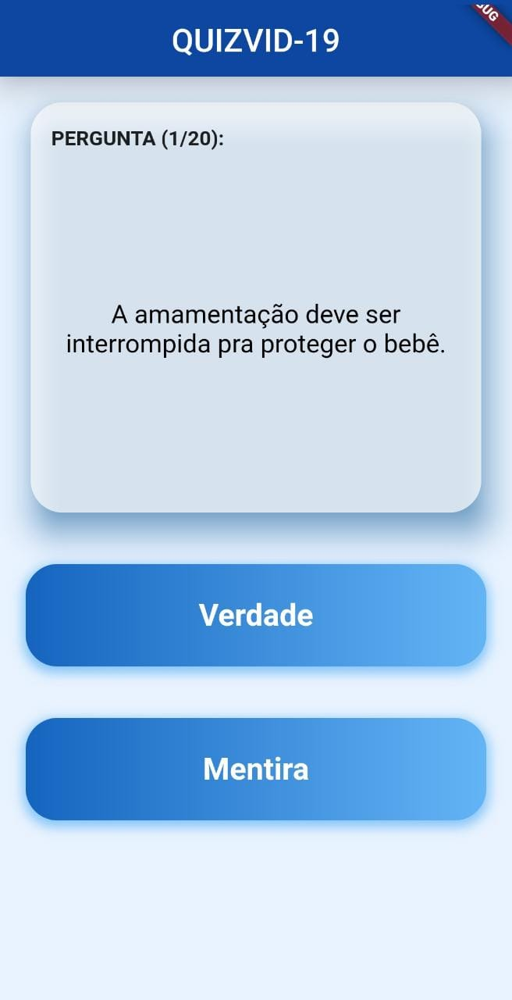
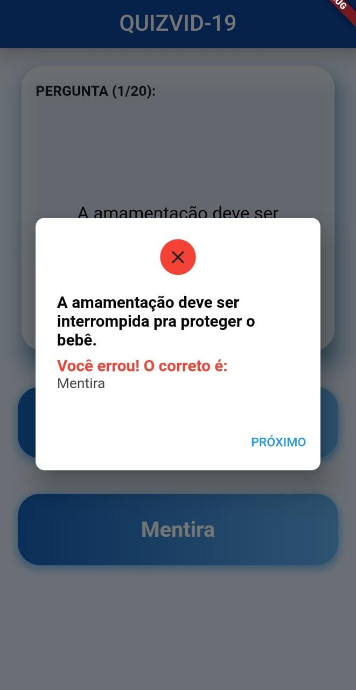
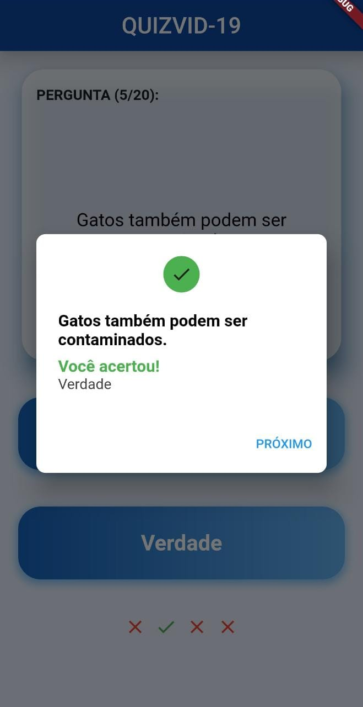
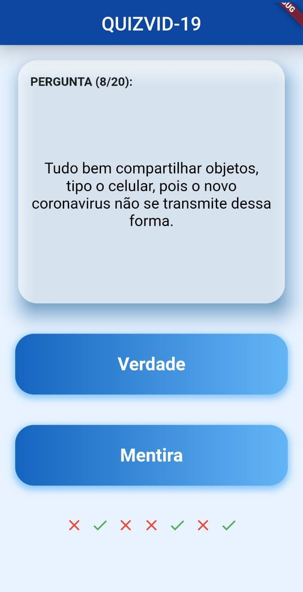
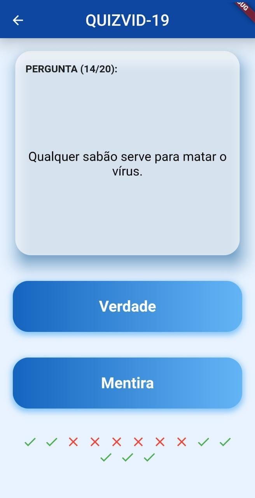
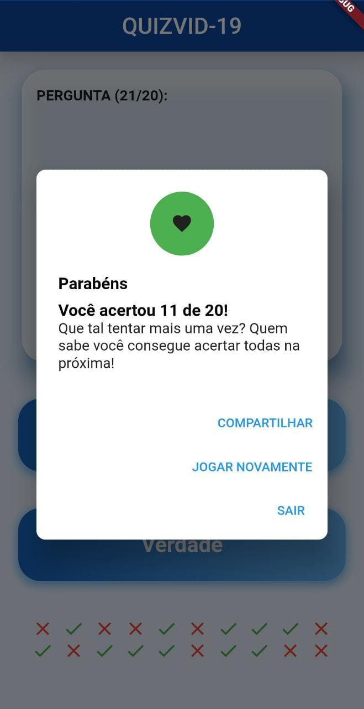

# Quizvid-19

Esta aplicação visa auxiliar a população no combate à COVID 19 apresentando informações relevantes sobre a doença utilizando o Flutter.
O aplicativo é um Quiz sobre o que é Verdade e o que é Mentira, em relação às tantas "informações" sobre o Corona Vírus.

## Capturas de Tela

    
    
    

    
    
    

## Getting Started

This project is a starting point for a Flutter application.

A few resources to get you started if this is your first Flutter project:

- [Lab: Write your first Flutter app](https://flutter.dev/docs/get-started/codelab)
- [Cookbook: Useful Flutter samples](https://flutter.dev/docs/cookbook)

For help getting started with Flutter, view our
[online documentation](https://flutter.dev/docs), which offers tutorials,
samples, guidance on mobile development, and a full API reference.
